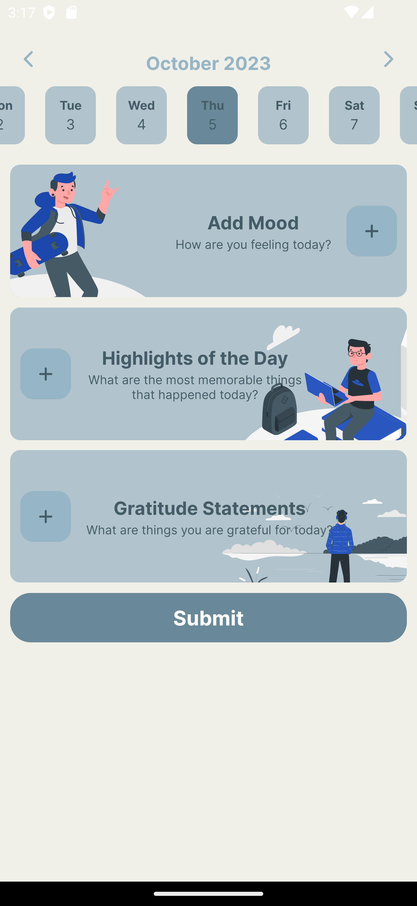
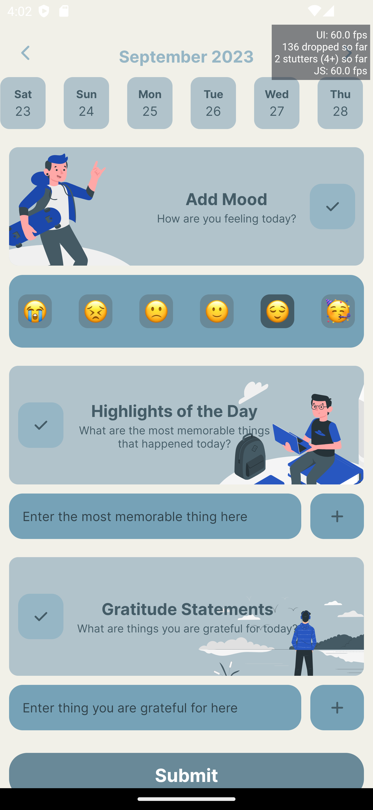

# gumtracker




A personal tracker app created using React Native. Written using TypeScript.

### Tech Stack Used:
- React Native written in TypeScript
- Styled Component to build UI 
- Expo (ejected and has been prebuild)
- Redux Toolkit and React Context as State Management
- AsyncStorage to cache data

### How To Run This Project in Your Computer
1. Pull this repo
2. Install dependencies
```
npm install
```
3. Create a new `.env.local` and add these keys:
```
API_KEY=<Your Google Spreadsheet API Key>
SPREADSHEET_ID=<Your Spreadsheet ID>
SPREADSHEET_NAME=<Your Sheet Name>
```
4. Since This was created by Expo but was ejected later, you can run the app by following this command:
```
npm run android (if you run this in your android device)
npm run ios (if you run this in your iPhone device)
```